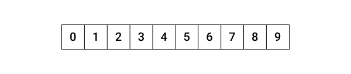
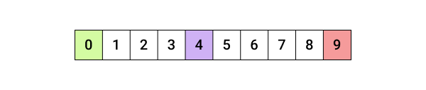
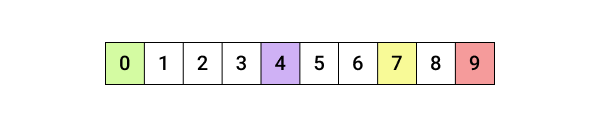
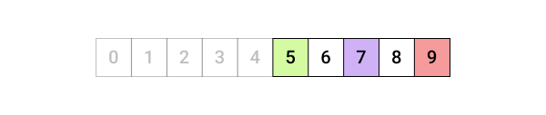
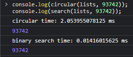

## Binary Search 소개

Binary Search Algorithm(이진 탐색 알고리즘)는 값을 찾는 알고리즘 중 하나입니다.

값을 찾는 또 다른 알고리즘 중 “순환 참조 알고리즘"이 있습니다.

순환 참조 알고리즘은 배열 안의 모든 값을 대조해서 우리가 찾고자 하는 값을 찾게 됩니다.

물론 배열 내 값의 개수가 적을 때는 문제가 없지만 배열 내 값의 개수가 많다면 값을 하나씩 참조를 하며 처리시간이 많이 걸릴 것입니다.

순환 참조 알고리즘의 이러한 단점을 개선하기 위해 나온 알고리즘이 이진 탐색 알고리즘입니다.

Binary Search는 배열의 중앙에 있는 index와 검색 대상을 비교하여 절반씩 나눠 값을 찾는 알고리즘입니다.

하지만 Binary Search도 단점이 있는데, 순환 참조와 달리 정렬된 배열 안에서만 사용 가능한 알고리즘이라 사용 환경은 일부 제한되지만 순환 참조 알고리즘에 비해 속도가 빠른 알고리즘입니다.

## Binary Search 원리 설명

먼저 검색할 값은 7로 지정하고 배열은 아래와 같이 구성하겠습니다.

그리고 검색 범위 기준점을 지정합니다.



그리고 검색 범위 기준점을 지정합니다.

low는 초록색으로 0부터 지정합니다.

high는 빨간색으로 배열의 길이에서 -1을 빼서 index를 기준으로 잡힌 길이로 지정합니다.

마지막으로 mid는 보라색으로 지정하며 low와 high를 더한 뒤 2로 나눈 값을 지정하는데, 이때 출력된 값은 소수점이 나올 수 있어 index로 지정할 수 없으니 소수점을 버린 값을 가져와 배열의 중앙이 될 index를 아래와 같이 지정합니다.



그럼 이제 목표로 지정한 7이라는 값을 아래와 같이 노란색으로 지정하고 중앙에 있는 4와 비교를 해봅시다.



중앙에 있는 4의 값이 7보다 작습니다.

그렇다면 배열의 범위는 최소 4 이상이라는 것을 알 수 있습니다.

그래서 low를 mid에서 +1을 더한 5라는 index로 지정해서 다시 반복을 합니다.

이제 다시 반복을 도는데 이번에는 low가 5로 다시 지정됐으니 우리가 참조할 범위를 아래와 같이 다시 지정합니다.



여기서 다시 배열의 중간 지점을 찾게 되는데, 이번에는 중앙 지점을 7로 지정합니다.

중앙에 있는 값으로 지정한 7과 우리가 찾을 값을 비교하는데, 이때는 이미 mid와 목푯값이 같아 목표를 성공적으로 찾았습니다.

그러므로 mid - 1을 반환하여 목표 index의 값을 출력하고 while 반복에서 탈출합니다.


이제 순환 참조와 이진 탐색 알고리즘을 비교하기 위해 아래와 같이 코드를 작성합니다.

```tsx
// Code //
const lists = new Array(100000).fill(null).map((_, i) => i)

// circular reference
function circular(list, target) {
  console.time("circular time");
  for (let i = 0; i < list.length; i++) {
    if (list[i] === target) {
      console.timeEnd("circular time");
      return i;
    }
  }

  return "X"
}

// binary search
function binarySearch(list, target) {
	let low = 0;
	let high = nums.length - 1;
	console.time("binary search time");

	while (low <= high) {
		let mid = Math.floor((high + low) / 2));

		if (nums[mid] === target) {
			console.timeEnd("binary search time");
			return mid
		} else if (nums[mid] > target) {
      high = mid - 1
    } else if (nums[mid] < target) {
      low = mid + 1
    }

		return "X"
}

console.log(circular(lists, 93742));
console.log(search(lists, 93742));
```

이제 해당 함수를 실행했을 때 Binary Search가 얼마나 빠른지 아래와 같은 결과로 알 수 있습니다.


