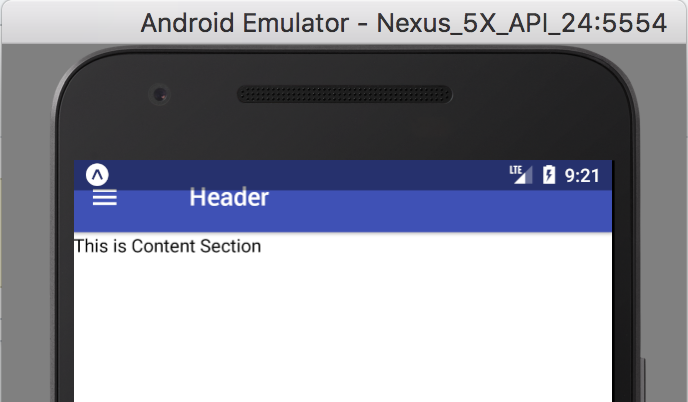

## 이슈 발견

프로젝트를 진행하면서 ios에서는 문제 없지만 안드로이드에서 컴포넌트들이 Status Bar안으로 들어가서 정상적인 출력이 불가능한 문제가 발생하여 해결방법을 올리고자 합니다.

> iPhone X 이후 iOS 기기에서 비슷하게 Status Bar와 하단 Bar 안으로 들어간다면 RN에서 제공하는 [SafeAreaView](https://reactnative.dev/docs/safeareaview)를 참고 하면 됩니다.



Android Status Bar 오류 스크린샷 (구글 검색)

## 해결 방법

### android에만 padding 적용하기

RN에서는 [Platform](https://reactnative.dev/docs/platform)이라는 API를 사용하여 사용자의 OS 이름을 알아낼 수 있습니다.

그리고 OS이름을 구분한 뒤 `padding`이나 `margin` 값을 주면 Status Bar의 높이와 근접하게 공간을 줘서 컨테이너 안으로 들어간 것 처럼 할 수 있습니다.

```jsx
import { Platform, StyleSheet } from "react-native"
// ...
const style = StyleSheet.create({
  // body View container
  body: {
    marginTop: Platform.OS === "android" ? 15 : 0,
  },
})
```

하지만 이렇게 적용하면 기기마다 값이 다르거나 Android의 버전이 변경되면서 margin 값도 달라질 수 있다는 점에서 좋은 방법이 아니라고 생각합니다.

그래서 유동적으로 변경되는 방법을 찾게 되었는데 마찬가지로 RN에서 제공하는 컴포넌트인 StatusBar를 아래 파트처럼 적용하면 됩니다.

### Status Bar의 높이를 가져오는 방법

이번에는 RN에서 [Status Bar 컴포넌트](https://reactnative.dev/docs/statusbar)를 직접 제어하는 방법입니다.

먼저 아래와 같이 컴포넌트를 import하면 됩니다.

```jsx
import { StatusBar, StyleSheet } from "react-native"
// ...
const style = StyleSheet.create({
  // body View container
  body: {
    marginTop: StatusBar.currentHeight,
  },
})
```

Status Bar의 높이를 어떻게 자동으로 가져오는지 조금 더 자세히 보고 싶다면 [RN 레파지토리](https://github.com/facebook/react-native)의 [StatusBar.js](https://github.com/facebook/react-native/blob/main/Libraries/Components/StatusBar/StatusBar.js)파일 250번 라인 이후와 [NativeStatusBarManagerAndroid.js](https://github.com/facebook/react-native/blob/main/Libraries/Components/StatusBar/NativeStatusBarManagerAndroid.js) 파일을 참고하면 되고, 이 방식을 사용 했을 경우 Native Module에서 직접 Status Bar를 가져오므로 높이 값이 변경 됩니다.

그리고 iOS에서는 [문서](https://reactnative.dev/docs/statusbar)에서 보거나 아래에 첨부한 StatusBar.js의 250번 라인부터 보면 null로 반환되는 것을 알 수 있는데, 이를 참고하여 StyleSheet를 생성할 때 [Nullish Coalescing](https://developer.mozilla.org/ko/docs/Web/JavaScript/Reference/Operators/Nullish_coalescing_operator)를 사용하거나 Platform API의 OS Property를 사용하여 안드로이드만 marginTop이 적용되게 하면 됩니다.

```jsx
// Libraries/Components/StatusBar/StatusBar.js
// 250번 라인부터 시작...
static currentHeight: ?number =
    Platform.OS === 'android'
      ? NativeStatusBarManagerAndroid.getConstants().HEIGHT
      : null;
// ...
```

하지만 이제는 `StatusBar`의 텍스트 색상이 배경색과 비슷해 보여서 안보이는 문제가 발생하는데 이 내용은 다음 글인 **“RN에서 StatusBar가 안보이는 문제”**에서 다루도록 하겠습니다.
