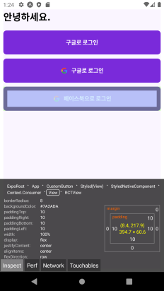

## line-height 적용 전 이슈

만약 커스텀 폰트를 적용해서 line-height를 자동으로 변경되게 한다면, OS / 기기 해상도 별로 높이가 달라져서 의도한 결과가 나오지 않는데 inspector를 열어서 보면 padding 값은 정상으로 출력 됐습니다.


iOS와 Android의 line-height 차이


iOS의 Inspector



Android의 Inspector

하지만 공통적으로 텍스트 하단이 띄워진 것을 보면 padding이 자동으로 적용된 듯싶어서 공식 문서를 본 뒤 아래와 같이 솔루션을 적용해 봤습니다.

## includeFontPadding 제거

`line-height`으로 해결이 됐다면 좋겠지만 고정된 `line-height`으로 인해 Android에서 텍스트가 위로 잘리는 현상이 발생합니다.

이러한 현상이 발생하는 이유는 Android는 폰트에서 기본으로 적용된 `padding`을 적용하는데 이때 폰트 기본 적용 `padding`을 남기고 텍스트 자체의 `line-height`만 적용하여 위로 밀리고 그대로 텍스트가 잘리는 현상이 발생하는 것입니다.

물론 Text 컴포넌트에 `padding` 값을 주어 텍스트가 잘리는 문제를 일부 해결할 수 있으나, 치수를 항상 직접 계산해야 하고 정확하게 해결할 수 있는 방법이 아니라서 개인적으로 불편했습니다.

그래서 이번에는 RN에서 제공하는 Style 속성 중에서 Android에서만 적용 가능한 `includeFontPadding`을 살펴보는데, iOS에서는 이러한 속성을 제공하지 않으니 넘어가도 좋습니다.

이제 폰트에 스타일을 적용할 차례인데 RN의 StyleSheet을 만들어서 스타일 속성을 추가하고 있다면 아래와 같이 적용하면 됩니다.

```jsx
import { React } from "react"
import { SafeAreaView, Text, StyleSheet } from "react-native"

function MyApp() {
  return (
    <SafeAreaView>
      <Text style={style.textStyle}>안녕하세요!!!</Text>
    </SafeAreaView>
  )
}

// 폰트는 이미 import 했다는 전제 조건으로 예제를 작성했습니다.
const style = StyleSheet.create({
  textStyle: {
    fontFamily: "Spoqa_Han_Sans_Neo", // import된 원하는 커스텀 폰트 추가
    includeFontPadding: false, // 추가! - Android만 적용
    fontSize: 24,
  },
})

export default MyApp
```

만약 styled-component를 통해 제작하고 있다면 아쉽게도 styled-component를 통해서 속성 추가가 불가능합니다.

그 이유는 typescript-styled-plugin에서 includeFontPadding, tintColor 등 RN에서만 사용되는 속성이 기본적으로 대응되지 않아서 생기는 증상입니다.

하지만 별도의 설정을 거친다면 적용할 수 있습니다.

[typescript-styled-plugin에서 존재하지 않는 속성 추가하는 방법](https://github.com/microsoft/typescript-styled-plugin/issues/58) 참고 후 위에서 styled-component로 컴포넌트를 만들어서 진행하시면 됩니다.

### MyApp.tsx (컴포넌트)

```tsx
import { React } from "react";
import { SafeAreaView, StyleSheet } from "react-native";
import styled from "styled-components/native";

// styled-components 적용
const styled.Text`
  font-family: "Spoqa_Han_Sans_Neo"; // import된 원하는 커스텀 폰트 추가
  font-size: 24px; // styled-components는 RN 상관없이 단위를 작성해야합니다.
	include-font-padding: false;
`

function MyApp() {
 // 폰트는 이미 import 했다는 전제 조건으로 예제를 작성했습니다.
 return (
  <SafeAreaView>
   <Text>
    안녕하세요!!!
   </Text>
  </SafeAreaView>
 )
}

export default MyApp;
```

### tsconfig.json

```tsx
{
 // ...
 "compilerOptions": {
    "jsx": "react",
    "strict": true,
		// plugin 추가 후 validProperties에 기존 CSS와 동일한 규칙으로 추가
    "plugins": [
      {
        "name": "typescript-styled-plugin",
        "lint": {
          "validProperties": [
						// ...
            "include-font-padding"
          ]
        }
      }
    ]
  },
 // ...
}
```

## 마지막으로...

line-height가 OS 별로 다르다보니 렌더링이 이상하게 되는 문제는 Text에서만 그러는 것이 아닌 마찬가지로 폰트를 사용하는 TextInput 등에서도 동일한 문제가 발견합니다.

만약 TextInput에서 커스텀 폰트를 적용하고 아래와 같이 위아래로 스크롤이 생긴 것처럼 출력된다면 Android만 line-height를 적용한다면 해결될 것입니다.


