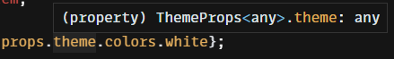
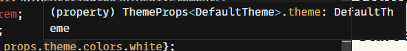

## 잃어버린 theme 타입을 찾아서...

React에서 styled-components를 사용하다 보면 전역 theme 변수를 지정해야 하는 상황이 생길 것입니다.



타입 선언 없이 theme를 불러올 때 theme 타입

상단 이미지와 같이 TypeScript와 styled-components가 적용된 프로젝트에서 theme를 적용할 수 있지만 작업하다 보면 자동완성이 되지 않는 것을 확인할 수 있습니다.

그 이유는 styled-components에 있는 DefaultTheme 타입이 any로 지정되어 있어 TypeScript에서 에러가 발생하지 않지만 any 타입으로 지정되어 있어 올바른 객체로 접근할 수 있는지 확인할 수 없는 단점이 생깁니다.

## 적용하기 전 필요한 개념 확인

### [declare](https://www.typescriptlang.org/ko/docs/handbook/declaration-files/by-example.html)

주로 변수, 상수, class, module 등이 이미 선언되었다는 것을 선언하는 문법입니다. 이번 포스트에서는 module을 declare 하는 방법을 다루고 있습니다.

또한 이 포스트에는 외부 라이브러리를 선언하는 방법도 포함되어 있으니 [TypeScript 문서에 포함된 Library Structures](https://www.typescriptlang.org/ko/docs/handbook/declaration-files/library-structures.html)을 참고하시면 됩니다.

선언된 변수들을 파일에 별도로 포함할 수 있는데, 이 파일의 확장명은 `.d.ts`입니다.

이 `d.ts`안에서는 선언부만 포함되어 있고 구현부는 포함 되지 않은게 특징입니다.

### [typeof](https://www.typescriptlang.org/docs/handbook/2/typeof-types.html#the-typeof-type-operator)

TypeScript에서 변수의 타입을 유추하기 위한 문법입니다.

이미 JavaScript에서도 존재하는 문법이지만 TypeScript에서도 Type 선언을 위해 사용할 수 있으며, 객체에서 사용할 경우 JavaScript에선 `object`이라고만 출력 되지만 TypeScript에서는 해당 객체 안에 있는 값의 타입까지 유추합니다.

```tsx
// Example
// as const로 상수 처리 후 아래와 같이 ThemeValue를 추가한다면 더욱 안전한 Union 타입으로 지정 가능합니다.
const theme = {
  colors: {
    primary: "blue",
    secondary: "lightgray",
    white: "#fff",
    black: "#000",
  },
  font: {
    family: "Spoqa Han Sans Neo",
    baseSize: "16px",
  },
  container: {
    maxWidth: {
      pc: "1200px",
      tablet: "700px",
      mobile: "500px",
    },
  },
} as const

type Theme = typeof theme
type ThemeValue = Theme[keyof Theme]
```

## theme 타입 선언하기

> 필자는 declare 파일을 src/types 폴더에 생성하는 것으로 진행했으나, 본인이 관리하기 편한 위치에 생성하셔도 괜찮습니다.

styled-component에 있는 theme의 기본 타입이 any라는 것을 알았으니 한번 적용해 봅시다.

먼저 상단 예제에 있는 theme.ts에서 Theme라는 type를 typeof로 export합니다.

```tsx
// theme.ts
// ...
export type Theme = typeof theme

export default theme
```

그리고 `styled-components.d.ts` 파일을 만듭니다.

그다음 파일을 열고 아래와 같이 코드를 작성합니다.

```tsx
import "styled-components"
import { Theme } from "../styles/theme"

declare module "styled-components" {
  // eslint 적용 시 아래와 같이 ignore를 적용하지 않으면 lint 에러가 발생합니다.
  // eslint를 적용하지 않았다면 아래 주석을 삭제하셔도 됩니다.
  // eslint-disable-next-line @typescript-eslint/no-empty-interface
  export interface DefaultTheme extends Theme {}
}
```

만약 이 과정을 모두 마쳤다면 이제부터 코드를 이해하기 위해 내용을 풀어봅시다.

먼저 styled-component module의 타입을 수정하기 위해 styled-components를 import 하고
 `declare module "styled-components"`를 작성합니다.

그다음 Theme(Theme 객체의 typeof 타입)를 import 하여 `DefaultTheme` interface에 extends를 해서 DefaultTheme에 any 대신 Theme 타입이 적용되게 합니다.

성공적으로 export 했다면 styled-components 코드에서 `${(props) => props.theme...}`를 입력할 때 타입이 아래와 같이 정상적으로 지정되는 것을 확인할 수 있습니다. (첫 번째 이미지와 비교해 보시면 이해하기 쉽습니다.)



타입 선언 후 불러온 theme 타입

## 최종 결과물

### 선언 전

<iframe src="https://codesandbox.io/embed/original-method-8rcmzx?autoresize=1&fontsize=14&theme=dark" style="width:100%;" height="500px"></iframe>

### 선언 후

<iframe src="https://codesandbox.io/embed/theme-with-declare-wf76qt?fontsize=14&hidenavigation=1&theme=dark" style="width:100%;" height="500px"></iframe>
