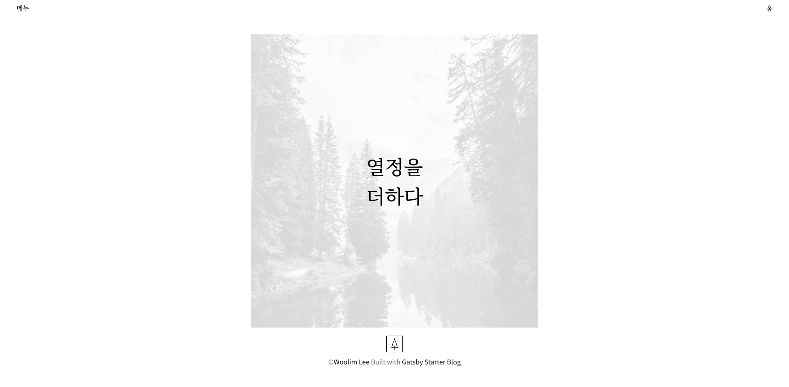
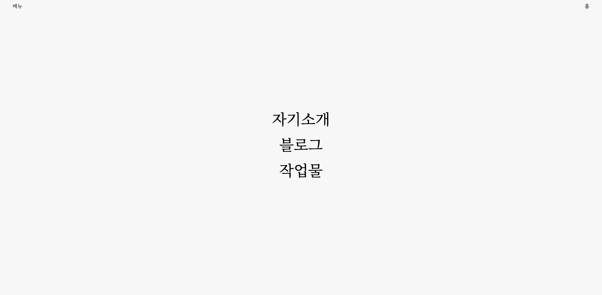
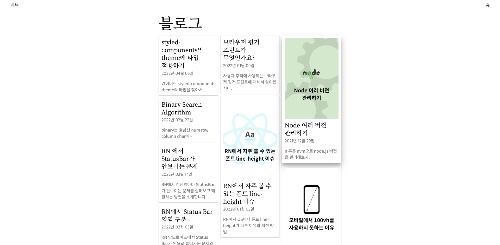
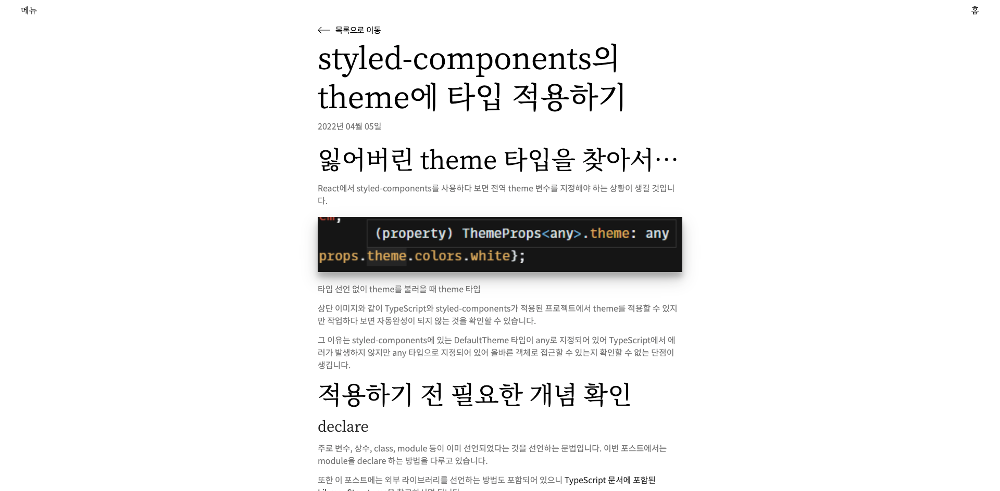
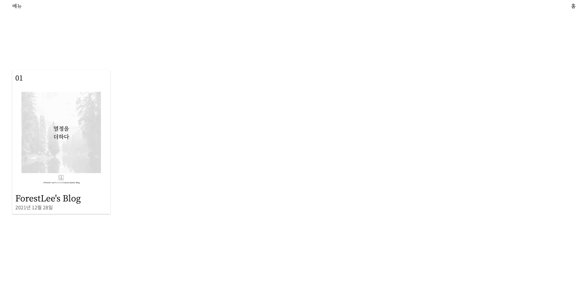
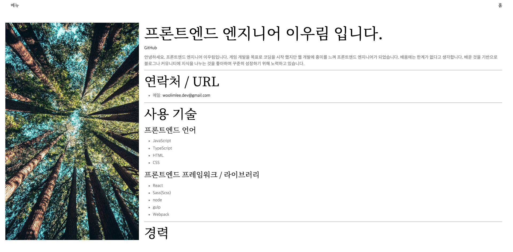

## 프로젝트 소개

Gatsby에서 제공되는 블로그 템플릿을 활용하여 SSG로 구동되는 블로그입니다.

개인적인 블로그로 활용하기 위해 Figma를 사용하여 처음부터 디자인을 제작 및 적용을 하였습니다.

배포는 SSG로 배포되는 Gatsby의 특징을 사용하여 정적배포가 가능한 GitHub Pages로 배포하였습니다.

- GitHub Pages 배포
- Figma를 사용하여 디자인 템플릿 제작
- 메인 페이지와 자기소개 모바일 페이지에 Parallex 효과 적용

## 프로젝트 관련 URL

[Github](https://github.com/ForestLee0513/ForestLee0513.github.io)

[Demo](https://forestlee0513.github.io/)

[Figma](https://www.figma.com/file/D82o736FkrXYb7lbKlhrsx/ForestLee-Design-Gidelines?node-id=0%3A1&t=XWXtSt1HvvWS36Iy-1)

## 페이지 미리보기

_기획 / 개발 단계에서 일부 변경 된 페이지도 포함하고 있습니다._

### 메인 페이지

### 메뉴

### 블로그 글 목록

### 블로그 본문

### 포트폴리오

### 이력서

