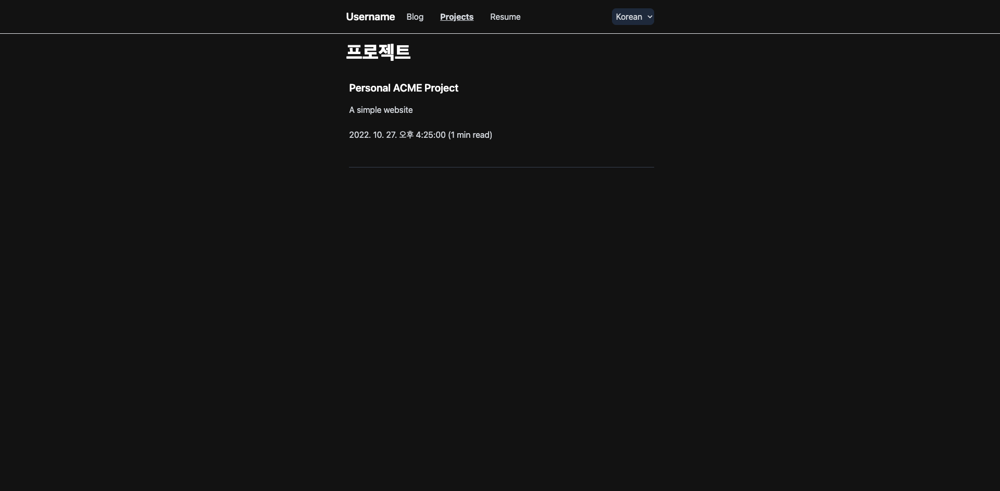

## 프로젝트 소개

기존 개인 블로그 프로젝트인 ForestLee’s Blog with Gatsby와 jbee.io의 블로그 형식을 참고하여 Next.js로 제작한 블로그 탬플릿이며 Github에서 탬플릿으로 사용 가능합니다.

기존 블로그를 운영하면서 컴포넌트 재사용성의 부족함을 느껴 컴포넌트 재사용성 위주로 고려하여 개선 했으며 빠른 디자인 구축을 위해 Tailwind CSS를 사용했습니다.

해당 프로젝트를 개발하며 MDX, 다크모드, 동적 OG Image와 같은 기존 블로그에 없던 새로운 기능을 추가했습니다.

- MDX 적용
- 다크모드
- TypeScript 적용
- 컴포넌트 재사용성
- Netlify, Vercel를 활용한 원클릭 배포 적용
- 동적 OG Image 썸네일(SSR 전용)
- Route 정보를 json파일로 동적 생성

## 프로젝트 관련 URL

[Github](https://github.com/ForestLee0513/blog-with-nextjs)

[Demo](https://blog-with-nextjs-nine.vercel.app/)

## 페이지 미리보기

_기획 / 개발 단계에서 일부 변경 된 페이지도 포함하고 있습니다._

### 메인 페이지

### 블로그 본문

### 포트폴리오

### 이력서

